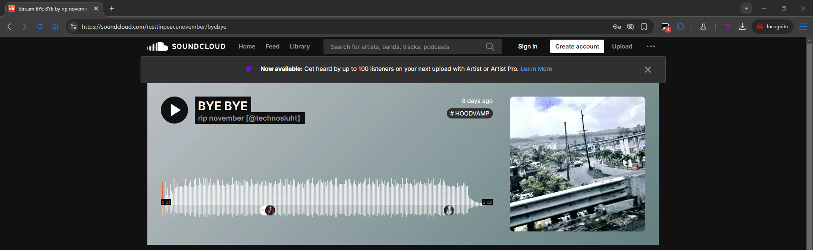
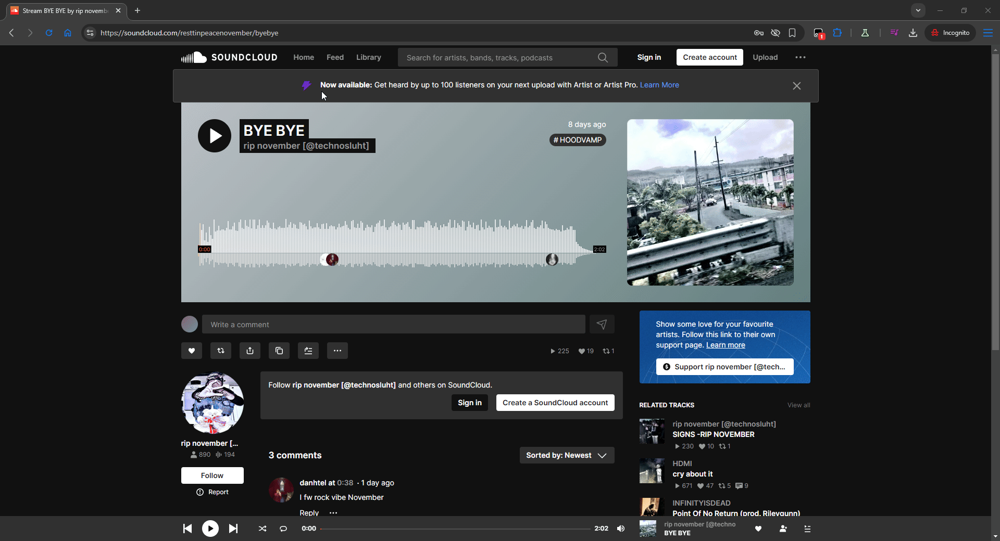

# 🎨 SoundCloud Save Artwork

  
  
  

  <h3>✨ Save high-quality artwork from SoundCloud with a simple right-click ✨</h3>

---

## 📸 Demo

  

## 🚀 Features

- 🖱️ **Simple Right-Click Menu** - Just right-click any artwork to save it
- 🖼️ **High-Quality Downloads** - Automatically fetches the highest resolution (500x500)
- 📝 **Smart Naming** - Files are named after the track title
- 🎯 **Works Everywhere** - Player, track lists, artist pages, playlists, and more
- ⚡ **Lightweight** - No performance impact on your browsing

## 📦 Installation

### Prerequisites
- Install [Tampermonkey](https://www.tampermonkey.net/) for your browser:
  - [Chrome](https://chrome.google.com/webstore/detail/tampermonkey/dhdgffkkebhmkfjojejmpbldmpobfkfo)
  - [Firefox](https://addons.mozilla.org/en-US/firefox/addon/tampermonkey/)
  - [Edge](https://microsoftedge.microsoft.com/addons/detail/tampermonkey/iikmkjmpaadaobahmlepeloendndfphd)
  - [Safari](https://apps.apple.com/us/app/tampermonkey/id1482490089)

### Install Script

1. **Click the install button:**
   
   

2. **Or install manually:**
   - Open Tampermonkey Dashboard
   - Click "Create a new script"
   - Copy and paste the script from [`soundcloud-save-artwork.user.js`](soundcloud-save-artwork.user.js)
   - Save with `Ctrl+S` (or `Cmd+S` on Mac)

## 🎯 Usage

### Saving Artwork from the Main Player

  

### Saving from Artist Pages

  

## 🛠️ How It Works

1. **Detection** - The script detects when you right-click on SoundCloud artwork
2. **Menu** - Shows a custom "Save Artwork" option in the context menu
3. **Download** - Fetches the high-resolution version and downloads it
4. **Naming** - Automatically names the file based on the track title

## 📋 Supported Locations

The script works on artwork found in:

- ✅ Main player (bottom bar)
- ✅ Track pages
- ✅ User/Artist pages
- ✅ Playlist pages
- ✅ Search results
- ✅ Stream/Feed
- ✅ Charts and trending pages

## ⚙️ Configuration

The script works out of the box, but you can modify these settings in the code:

- **Image Quality**: Default is 500x500 (highest available)
- **File Format**: Default saves as `.jpg`
- **Naming Convention**: Uses track title with underscores replacing special characters

## 🐛 Troubleshooting

<b>Menu doesn't appear when right-clicking</b>

- Make sure Tampermonkey is enabled
- Check that the script is active (should have a green dot in Tampermonkey)
- Refresh the SoundCloud page
- Make sure you're clicking directly on the artwork image

<b>Download fails or shows error</b>

- Check your browser's download settings
- Make sure you have permission to save files
- Try disabling other extensions that might interfere
- Check browser console for specific error messages

<b>Wrong image quality or size</b>

- The script automatically fetches the 500x500 version
- If the track only has lower quality artwork, that's what will be saved
- Original upload quality varies by artist/track

## 🙏 Acknowledgments

- Built for the SoundCloud community
- Powered by [Tampermonkey](https://www.tampermonkey.net/)
- Inspired by the need to save beautiful album artwork

---

  
Made with ❤️ for music lovers

  

    <a href="#-soundcloud-save-artwork">Back to top ↑</a>
  

